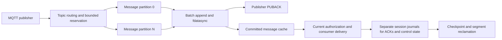

# Persistent QoS 1 and partitioned journals

`persistence.enabled` retains TCP subscriptions and pending QoS 1 deliveries using
broker-owned append logs. There is no Kafka process/client, SQL database, application
API, PostgreSQL, Redis, or authorization management dependency in this storage module.
SQLite remains an optional, unrelated authentication provider.

## Data flow and concurrency



Topics map to a fixed number of message partitions using FNV-1a-64. Each partition
has its own directory, append descriptor, bounded admitted work and OS worker.
Independent topic partitions can flush concurrently, including messages addressed
to the same wildcard subscriber. A hot topic stays in one partition. The short
in-memory routing/reservation mutex does not cover file writes or synchronization.
Session journals are independently sharded by Client ID. They record connection
ownership/generations, subscription changes, ACKs and exceptional packet-ID claims.
Their disk work does not sit in the message append queue.

Workers group up to 64 requests with a maximum 1 ms batch-formation wait. A publication
contains the payload once plus its recipient-generation and Packet ID references.
All matching recipients' logical quotas are reserved atomically before admission.
The normal path assigns Packet IDs in that same append, avoiding a second durable
transaction before delivery. A backlog exceeding the 65,535-ID space claims freed
IDs through the session journal before those packets can be sent.

Only after the append batch's `fdatasync` succeeds does a publication become visible
in the committed cache and receive a positive publisher PUBACK. Cached delivery does
not re-read disk. Consumer wakeups use eventfd with a revision check; there is no 5 ms
idle polling loop. Fetches return at most 32 messages / a 256 KiB target (one larger
packet may exceed the target), honor the receive window, and yield between batches.
A short state mutex still serializes bookkeeping; this is not an unlimited scale-out
engine. Measured capacity is in [the load report](performance/durable-concurrency.md).

## Protocol and durability contract

1. Establish the TCP persistent subscription before publishing traffic that must
   survive a consumer outage. MQTT 3.1.1 uses CleanSession=false. MQTT 5 uses a nonzero
   Session Expiry Interval; reconnect with Clean Start=false to resume.
2. Publish with QoS 1. Positive publisher PUBACK means the matched durable delivery
   references and payload reached the broker's committed log, not application SQL.
   Publication without a matching established persistent subscription creates no
   offline queue. QoS 0 is not made durable.
3. Reconnect with the same authenticated owner and Client ID. The broker restores
   subscriptions and outstanding Packet IDs. Recovery conservatively sets DUP for
   assigned IDs; a packet may have been committed but never reached the old socket.
4. Consumers acknowledge after their own required persistence boundary. ACK journals
   identify exact `(session generation, message, packet)` entries. A high ACK does
   **not** skip earlier holes. ACK recording is asynchronous and batched; a crash
   before it commits can repeat a delivery. Application IDs must support deduplication.

Pending entries include append reservations in acceptance order. A fetch cannot pass
an earlier uncommitted publication to that client, including across topic partitions.
Thus disk workers run concurrently while client replay preserves the accepted order.
A stalled earlier message can intentionally hold later messages to the same consumer;
a consumer for an independent partition continues to receive.

Clean Start discards the previous owner's session/queue. Another authenticated owner
cannot take over a retained Client ID. Connection epochs fence late socket operations,
while a stable session generation ties stored delivery references to the correct
incarnation. Replay checks current READ authorization for every message, including
revocation and cached authorization outage limits. The prior five-minute ceiling
and original authorization session expiry remain unchanged.

Session expiry is capped at 24 hours by default. Online deadlines are journaled by
one-second heartbeats; recovery uses the last persisted deadline and never grants a
new lease from restart time. Delayed disk work can shorten that recovery window.
Message expiry and explicit MQTT 5 zero expiry are honored.

Admission/quota failures withhold positive publisher PUBACK and close the publishing
connection for retry. Accepted older messages are never evicted to admit new ones.
Actual journal write/sync failure fails persistent traffic closed and requires
storage recovery/restart; new clean sessions without retained state can still connect.
Checkpoint or obsolete-segment reclamation errors retain the usable logs and retry
with backoff rather than poisoning the store. A complete record written before a failed sync may appear
on replay even though its publisher did not receive success: this is the ordinary
QoS 1 ambiguous-receipt boundary.

## Files, recovery and reclamation

The storage path is a **directory**, mode 0700. Files and the exclusive adjacent
`.lock` use mode 0600. A second broker cannot own the same path.

- `FORMAT`: checksummed engine version and immutable partition count.
- `messages-N/00000000000000000001.log`: sequential message segments.
- `sessions-N/...log`: independent session/control/ACK segments.
- `CHECKPOINT`: checksummed session state, exact pending references and per-log cuts.

Each record has a versioned magic, length, monotonic log serial, header CRC and body
CRC. New segment directory entries are synced. Recovery truncates only an incomplete
final frame in the last segment; a complete checksum mismatch, damaged sealed frame,
missing post-checkpoint serial or missing referenced segment refuses startup.

Checkpoints briefly freeze admission, fence and seal every log, and copy committed
state and segment references. Admission resumes before snapshot encoding or disk I/O.
Event coroutines use cooperative lock acquisition and do not block their OS thread
behind the snapshot. They do not treat the maintenance fence as quota exhaustion.
The checkpoint is written to a temporary file, fsynced, renamed and its directory fsynced **before**
eligible segments are unlinked. A live delivery pins its containing message segment;
ACK gaps and offline readers cannot be reclaimed past. Session segments covered by
the checkpoint can be removed. Crashing before/after checkpoint installation leaves
either the older logs or the new checkpoint plus all its referenced segments usable.
Reclamation is queued on the owning log worker and cannot race new appends. Heartbeats
are split into bounded records, including when clients use long identifiers.
The snapshot admission pause remains part of sustained latency measurements.

## Bounds and configuration

```yaml
persistence:
  enabled: true
  path: /data/sessions.db  # DIRECTORY; basename retained to reject legacy-file upgrades
  partitions: 4           # four message writers plus four session writers
  segment_bytes: 16777216
  max_disk_bytes: 4294967296
  checkpoint_interval_ms: 30000
  max_session_expiry_seconds: 86400
  max_sessions: 10000
  max_subscriptions_per_session: 128
  max_messages: 100000
  max_messages_per_session: 100000
  max_bytes: 268435456
  max_requests: 1024
  max_request_bytes: 16777216
  max_inflight: 32
```

`max_bytes` counts logical pending payload bytes **per recipient**. Payload objects
are shared by recipients, but the full bounded pending payload set is held in memory;
this version does not provide a disk-backed LRU cache for larger-than-memory backlogs.
Startup additionally builds compact ACK identities for the post-checkpoint session-log
interval before reading message bodies, so already-consumed payloads are not cached.
Delivery copies share the I/O byte budget and use at most half of it, so slow sockets
cannot create an unbounded second copy of the backlog. Admission covers at most 1,024
requests / 16 MiB across writers and delivery results. MQTT connection/input buffers
are additionally bounded by the connection and packet-size configuration.
Metadata is limited to four times the I/O byte budget and a conservative checkpoint
size reservation. Reducing limits below recovered data refuses startup rather than
discarding the backlog. Admission waits cooperatively for up to 500 ms; event threads
do not block on disk. A topic/consumer hot spot can still create queueing.

Three quarters of `max_disk_bytes` is divided equally among the message and session
logs; the remaining quarter covers two checkpoint generations/temporary files.
A hot partition can fill its own allowance before other partitions fill theirs.
High disk usage triggers earlier checkpoint/reclamation. A quota rejection does not
poison the writer; real I/O failure does. Segment sizes are rotation targets: a single
larger record occupies a larger segment. Filesystem allocation/metadata still needs
additional free-space headroom beyond counted file bytes. Back up the whole directory
while the broker is stopped; never copy just one segment or one checkpoint.

## Upgrade from the SQLite version

The wire contract remains QoS 1, but `durable_sessions_contract` is now **2** because
the on-disk format changed. Existing configured basenames are deliberately preserved.
An old SQLite file at that path refuses startup instead of starting an empty store at
a different implicit path. Do not delete or rename the old volume to make startup pass.

Stop the old broker, retain a backup, build the native importer, then migrate into a
new directory on the same machine with the Python standard-library export tool:

```sh
cmake --build build-native --target mqtts-store-import --parallel 3
python3 bin/migrate-sqlite-journal.py \
  --source /data/sessions.db \
  --destination /data/journal \
  --importer "$PWD/build-native/mqtts-store-import" \
  --partitions 4
```

The source opens read-only under the old broker's ownership lock. Source bytes are
not rewritten. Existing destinations are rejected. Ownership, subscriptions, expiry
deadlines, queued payloads and assigned Packet IDs migrate; expired data retains its
original expiration semantics. The native importer is also included at
`/app/bin/mqtts-store-import` in the runtime image. The Python export command requires
a Python 3 maintenance environment; it is not a broker runtime dependency.

The importer currently enforces default store limits (10,000 sessions, 100,000 pending
messages and 256 MiB logical payloads). An oversized source is refused and kept intact;
review/configure a larger importer before migrating a deployment with custom limits.
An interrupted destination carries `IMPORTING` and refuses broker startup. Retry into
a new destination from the intact source. After successful import, explicitly change
`persistence.path` to `/data/journal`, keep the chosen partition count, then start the
new broker. Retain the source until recovery and message counts are verified.

## Supported boundary and verification

This is single-broker, local-disk durability for TCP persistent consumers and QoS 1.
There is no cross-node replication, leader election, shared subscription load balancing,
durable retained-message store, durable QoS 2, or persistent WebSocket consumer support.
TCP and WebSocket publishers both enter the same durable publication path. Persistence
advertises maximum QoS 1 and rejects QoS 2 publication / persistent WebSocket sessions.
Disk loss, expired records and intentional session reset remain outside this guarantee.

Native tests cover journal framing/corruption, torn tails, missing records, rotation,
checkpoint reclamation, exact ACK gaps, more than 65,535 pending messages, Packet ID
exhaustion/reuse, owner/epoch fencing, migration and capacity refusal. Real MQTT tests
use SIGKILL around committed publications and checkpoints, verify current ACL replay,
and inject actual `write`/`fdatasync` errors through a **test-only** preload library.
A stalled message partition test verifies that a different partition continues to
publish/deliver and that no success is returned before the stalled flush completes.

Delivery failures are handled per record. An authoritative current READ denial or a
packet larger than MQTT 5 Maximum Packet Size is durably removed before continuing
with later messages. The latter follows MQTT-3.1.2-25. A malformed stored PUBLISH is
also removed with a `malformed` diagnostic; inbound empty topics, wildcard topics
and unsupported topic aliases are rejected before journal admission. Each removal
logs the client, epoch, packet ID and reason and increments the corresponding
`DurableStore::Statistics.discarded_*` counter. Payloads and credentials are not logged.
Authorization timeouts, backend outages, throttling and stale revision responses
retain the message and retry; they are not interpreted as a permanent denial.
Restoring access does not resurrect deliveries already rejected by an authoritative
policy decision. Delivery authorization queues a bounded fetch batch before awaiting
results, allowing the independent RPC workers to use Protobuf BatchAuthorize.
Decoded packets use a separate bounded budget proportional to the globally reserved
wire bytes, so a large accepted publication cannot exhaust a receiver's client pool.
