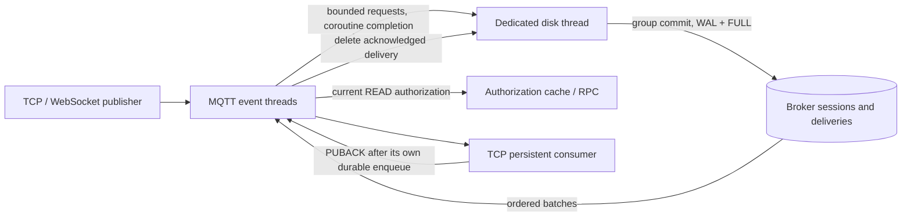

# Durable TCP sessions and QoS 1 delivery

Enable `persistence.enabled` to retain TCP subscriptions and pending QoS 1 deliveries
on a broker-owned local SQLite volume. This module does not call application APIs,
PostgreSQL, Redis, or the authorization management API. Ordinary TCP and WebSocket
publishers both enter this path. Every replayed delivery passes the existing current
READ authorization check, including its bounded cache and original session expiry.



## Receipt and recovery contract

1. A consumer establishes a named session and successfully subscribes at QoS 1.
   MQTT 3.1.1 uses CleanSession=false; MQTT 5 uses a positive Session Expiry Interval
   and Clean Start=false when resuming. CONNACK reports Session Present.
2. A matching QoS 1 publication is committed before the publisher receives a positive
   PUBACK. One stored payload is referenced by all matching persistent recipients;
   overlapping filters for the same client create one delivery.
3. Disconnect and process crashes preserve unacknowledged deliveries. Reconnection
   restores subscriptions, reuses assigned packet IDs, and sets DUP on retransmission.
   The client receive window and `max_inflight` bound delivery; ACK removes the record.
4. A consumer can ACK after committing its own spool, then process that spool independently.
   Publisher PUBACK is a broker receipt, not an application database commit. Consumers
   must deduplicate by stable application message ID across the two ACK boundaries.

Clean Start discards the previous session and queue for the same authenticated username.
A different username cannot take over a retained Client ID, even with Clean Start.
Connection epochs reject late ACK/disconnect operations from an older socket. Message
Expiry and Session Expiry remove stale data; MQTT 5 explicit zero expiry is preserved.
Session TTL is capped at 24 hours by default. After a crash, expiry uses the last broker
heartbeat, conservatively up to one second early, without extending it on restart.

No positive PUBACK is sent if admission is full, a matching recipient exceeds its quota,
or the transaction fails. The connection closes so the publishing client can retry.
Admission/quotas apply atomically across durable recipients; accepted older records are
never evicted to admit new ones. Expiry and explicit session reset are deliberate deletion.

## Concurrency and resource bounds

Network event threads only wait cooperatively for disk completions; SQLite and filesystem
sync run on one separate OS thread. The worker groups up to 32 requests with a 1 ms
batching window, isolates each operation with a savepoint, and signals success only after
COMMIT. Subscriber PUBACK deletions enter the same bounded batch queue without blocking
the socket receive loop one fsync at a time; a failed deletion forces reconnect, and a
crash before deletion may legitimately repeat delivery. A worker-owned topic trie avoids scanning all persisted subscriptions per publish.

Defaults: 1,024 outstanding I/O requests and 16 MiB of estimated request/result reservations.
Delivery reads may use at most half the byte budget and are admitted only while
the request queue is below one-quarter capacity, reserving space for publish/ACK.
A connection can wait cooperatively up to 500 ms for write/ACK admission; sustained
overload closes it without a positive publisher receipt. Admission waiters are
bounded by the configured connection limit and carry that connection’s current packet.
Each fetch returns up to 32 messages, stops after 256 KiB (one larger message may exceed
that target), and delivery yields between batches. Idle connections use an atomic revision
signal; they do not continuously poll SQLite. Disk stalls can backpressure durable traffic,
but do not block the network event thread. This is bounded concurrency, not unlimited IOPS.

```yaml
persistence:
  enabled: true
  path: /data/sessions.db
  max_session_expiry_seconds: 86400
  max_sessions: 10000
  max_subscriptions_per_session: 128
  max_messages: 100000
  max_messages_per_session: 100000
  max_bytes: 268435456
  max_requests: 1024
  max_request_bytes: 16777216
  max_inflight: 32
```

The directory must exist and be writable by the broker user. The runtime image creates
`/data` with the correct ownership; mount a persistent named volume there. The store and
lock file use mode 0600, and an exclusive lock rejects a second broker on the same path.
Budgets count logical delivery bytes **per recipient**; SQLite pages, metadata and WAL need
additional disk headroom. `max_request_bytes` must be at least 4 MiB. Monitor free space and
`Persistent publish refused` / `Persistent transaction failed` logs. Stop the broker before
backing up the whole volume (including any WAL), or use SQLite's online backup mechanism.

## Supported boundary

This feature provides single-broker, local-disk durability for TCP persistent consumers
and QoS 1. It does not provide replication, shared subscriptions, durable retained messages,
QoS 2, or persistent WebSocket consumers. With persistence enabled, CONNACK advertises
maximum QoS 1 and persistent WebSocket session requests are rejected explicitly. Normal
browser sessions still publish and receive online messages. Use a standalone broker for
this delivery guarantee; cluster/router failover does not transfer this local queue.

No queue exists before the first successful persistent subscription. QoS 0 publications
are not retained. Losing the disk, exceeding expiry, deleting a volume, changing identity,
or starting with Clean Start can discard state. A revoked or expired permission cannot
be bypassed by persisted subscriptions: blocked records stay queued until permission is
restored or expiry/reset removes them, preserving per-client order.

## Reproducible checks

```sh
ctest --test-dir build --output-on-failure --timeout 120
python3 unittest/durable_concurrency.py --broker "$PWD/build/mqtts" \
  --pairs 500 --messages 128 --payload-bytes 4096 --report /tmp/durable-report.json
```

`test_mqtt_durable_store` covers ownership, restart, epoch fencing, overlapping filters,
packet IDs, receive windows, quotas, expiry, and concurrent writes. `mqtt_durable_integration`
uses disposable real brokers to cover both TCP protocol versions, WebSocket publishing,
SIGKILL after publisher ACK, unacknowledged retransmission, session takeover, current ACL
revocation, explicit expiry, capacity refusal, and actual SQLite write-lock failure.
CI also measures durable delivery with cached authorization healthy and unavailable.
