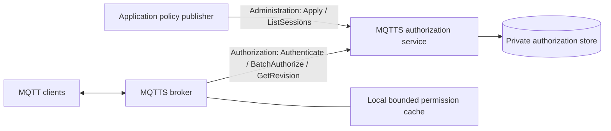

# Independent authorization module

`modules/authz` is part of MQTTS, deployed as the separate `mqtts-authz` process.
It has its own Go module, tests, configuration, durable policy store and image.
The C++ broker depends only on the [Protobuf contract](proto/authorization.proto).
No application database, HTTP callback, business role or application Topic is
required by this module. Applications publish generic permissions over the
management API. The optional HTTP broker provider remains supported separately.



## Run and configure

Go 1.25+:

```sh
cd modules/authz
go test -race ./...
go build -o bin/mqtts-authz ./cmd/mqtts-authz
# Provide separate random query/admin tokens via protected files or environment.
AUTHZ_QUERY_TOKEN_FILE=/private/query-token \
AUTHZ_ADMIN_TOKEN_FILE=/private/admin-token \
AUTHZ_TLS_CERT=/private/server.pem AUTHZ_TLS_KEY=/private/server-key.pem \
AUTHZ_LISTEN=127.0.0.1:50051 bin/mqtts-authz
```

Build the independent image with `docker build -t mqtts-authz modules/authz` from
the repository root. It runs as UID 10001 and stores data in `/data`. CI exports
both independently built images in the same versioned runtime artifact; metadata
records their names, source revision and Protobuf SHA-256.

| Variable | Default / behavior |
| --- | --- |
| `AUTHZ_LISTEN` | `127.0.0.1:50051`; image uses `0.0.0.0:50051` |
| `AUTHZ_STORE` | `data/authorization.db`; image uses `/data/authorization.db` |
| `AUTHZ_QUERY_TOKEN[_FILE]` | Required, 32–4096 characters |
| `AUTHZ_ADMIN_TOKEN[_FILE]` | Required; must differ from query token |
| `AUTHZ_TLS_CERT`, `AUTHZ_TLS_KEY` | Server TLS certificate and key |
| `AUTHZ_CLIENT_CA` | Optional CA requiring verified client certificates |
| `AUTHZ_INSECURE` | Only literal `true` permits plaintext on an isolated private network |
| `AUTHZ_CACHE_TTL_MS` | 10000; range 0–300000 |
| `AUTHZ_CONCURRENCY` | 128 admitted query RPCs, independent 4-slot management limit |
| `AUTHZ_MAX_SESSIONS` | 100000 |
| `AUTHZ_MAX_STORE_BYTES` | 268435456 serialized policy bytes; additional runtime memory is needed |

Keep the management endpoint private. Credentials are sent as `authorization:
Bearer …` metadata. Tokens, passwords and payloads are never logged. TLS verifies
hostnames; Broker `ca_file`, `client_cert_file` and `client_key_file` support a
private CA and optional mutual TLS. Plaintext must be explicitly selected on
both ends; it is used only by the isolated fixtures and internal Compose example.

## RPC semantics

- `Authenticate`: validates password SHA-256, exact client ID, enabled state and
  the original session/projection expiry. CONNECT is never cached across sessions.
- `BatchAuthorize`: 1–64 items, unique nonzero request IDs, independent allow/deny/
  unavailable outcomes. Replies include expiry, cache limits and policy revision.
  The entire batch reads one immutable policy snapshot. Payloads are raw bytes.
- `GetRevision`: opaque revision, polled independently of authorization workers.
- `Apply`: atomic durable upsert/delete batch, at most 128 changes. Inserts use
  `create_only`; updates/deletes require `expected_version`. Read that version
  before reading source permissions. Existing identity/client/password/namespace
  and original session expiry cannot be changed. Rotate credentials by issuing
  a new identity and revoking the old one.
- `ListSessions`: namespace-filtered pages of at most 128 records, with a policy
  version for CAS and opaque source context for the publisher's reconciliation.

New identities and lease-only renewals leave the CAS version and public revision
stable so login traffic does not invalidate unrelated caches or starve revocation.
Permission changes invalidate both; source-context changes invalidate CAS only.
Pages are not a frozen snapshot of concurrent new identities; publishers should
repeat reconciliation periodically. CAS rejects reads preceding a permission change.
Restarting the service creates new versions; old broker grants are invalidated.

Policy and client-session expiries must be at most five minutes ahead. A publisher
may renew `policy_valid_until_ms`, never the original client expiry. A service
identity can use `expires_at_ms = 0`, but its permission projection still expires
within five minutes unless the publisher renews it. Keep clocks synchronized.

Rules use MQTT filter containment and separate publish/subscribe actions. Root
wildcards exclude `$` Topics. Optional JSON-pointer bindings compare declared
string fields to constants or the MQTT Topic. All present aliases must match;
`required_any` requires at least one declared path. Duplicate keys, ambiguous
case-folded keys, invalid JSON and nesting over 64 are denied. Without bindings,
binary payloads are opaque. No business field names are hardcoded in this module.

The store uses bbolt for serialized durable writes, then atomically publishes
immutable records to concurrent in-memory readers. Reads do not wait for disk
transactions. Expired client records are pruned. Limits: 4 MiB RPC messages,
1 MiB payload/item, 1 MiB/session, 4096 rules and 256 KiB source context/session,
bounded admissions and 2-second query /
5-second management execution contexts. Transport clients must also set deadlines.

This implementation has **one authoritative service/store**, supporting many
broker and application processes. It is not a replicated authorization cluster;
do not load-balance independent bbolt databases or share the file over NFS.
Horizontal service replication requires an ordered replicated policy store or
snapshot/event distribution protocol. Application databases remain independent.

## Broker provider

```yaml
auth:
  enabled: true
  allow_anonymous: false
  cache_enabled: false
  providers:
    - type: grpc
      settings:
        endpoint: authz.internal:50051
        token_file: /private/query-token
        ca_file: /private/ca.pem
        publish_payload: bytes
        max_payload_bytes: 1048576
        timeout_ms: 500
        rpc_workers: 4
        rpc_queue_capacity: 64
        rpc_queue_bytes: 16777216
        batch_max_requests: 32
        batch_max_bytes: 4194304
        batch_wait_ms: 1
        cache_ttl_ms: 10000
        cache_max_age_ms: 300000
        cache_max_entries: 16384
        cache_version_interval_ms: 250
        failure_cooldown_ms: 1000
```

Four worker threads share a reused gRPC channel. Cold/refresh authorization work
is combined for at most 1 ms, 32 requests or 4 MiB; CONNECT bypasses aggregation.
Timeout includes queue time. Overflow, malformed IDs/envelopes and uncached
timeouts deny. The breaker opens after three failed calls. Revision polling has
a reserved thread. No RPC runs on the MQTT event thread. A pending delivery yields
its send queue, while preserving each client's order and bounded outstanding work.

HTTP and gRPC share the same 16-shard LRU, single-flight refresh, generation guards
and original-session expiry checks. Fresh hits perform no RPC. Stale positive hits
return locally while refreshing. Explicit denial removes a grant; failures never
advance its original deadline. Reuse ends at the earliest of the original session,
projection expiry and maximum five-minute cache age. Cached denials last ≤1 second.
`publish_cache_ignored_fields` is optional application configuration: omit it unless
the publisher guarantees those top-level fields do not affect authorization.

## Verification and contract generation

`go test -race ./...` covers mixed 64-item batches, concurrent queries, token
separation, durable revocation, lease/session expiry, CAS, capacity, wildcards and
ambiguous identities. Native `test_mqtt_auth_grpc` checks reordered/malformed reply
IDs, 128 cold decisions in batches, outage cache expiry and in-flight revocation.
Existing HTTP tests run against the shared cache implementation as well.

```sh
go -C modules/authz build -o /tmp/mqtts-authz-fixture ./integration/fixture
python3 unittest/grpc_auth_concurrency.py --broker "$PWD/build-native/mqtts" \
  --authz-fixture /tmp/mqtts-authz-fixture --pairs 500 --messages 64 \
  --payload-bytes 4096 --report /tmp/mqtt-grpc.json
```

This fixture starts isolated loopback processes, seeds generic policies and checks
actual QoS 1 delivery through TCP, both healthy and with the authz process paused.
On the development VM, 1000 connections / 500 publishers / window 4 delivered
32000 4-KiB messages per phase: 9535/s healthy and 9779/s paused, P95 184/180 ms.
These are measurements on a shared VM, not a production capacity guarantee.

The [expanded concurrency verification](../../docs/performance/grpc-concurrency.md)
covers a 60-second paced load, cache refresh, paused authorization, cold requests,
simultaneous CONNECT, slow authorization after revision changes and group fanout.
It records the original burst refusals/fanout crash and the subsequent fix and
1024-item queue experiment. Raw before/after results and remaining limits are
included; the generic provider's default queue remains 64.

Generated Go bindings are committed; C++ bindings are generated by CMake using
`protobuf-compiler`, `protobuf-compiler-grpc` and `libgrpc++-dev`. Regenerate Go with
`protoc-gen-go@v1.36.9`, `protoc-gen-go-grpc@v1.5.1` and `bin/generate.sh`.
